** 软件工程大作业
在线零食销售系统 
（Online snack sales system） 
**
============
**目  录**
-------------
第1章 引言
>1.1 研究背景

>1.2 国内外研究现状

>1.3 目标和意义

第2章 可行性分析

>2.1 技术可行性分析

>2.2 经济可行性分析

>2.3 运行可行性分析

第3章 需求分析

>3.1 系统用例建模

>3.3.1 系统用例分析

>3.1.2 系统用例说明

>3.2 需求分析

>3.2.1 业务需求分析

>3.2.2 用户需求分析

>3.2.3 功能需求分析

>3.2.4 非功能需求分析

>3.2.5 约束条件分析

>3.2.6 业务规则分析

>3.2.7 外部接口需求分析

第4章 系统设计

>4.1 实体类模型设计

>4.2 动态模型设计

>4.3 数据模型设计

第5章 系统实现

>5.1 开发环境

>5.2 新闻发布模块实现

>5.3 新闻管理模块实现

第6章 系统测试

>6.1 测试工具

>6.2 单元测试

>6.3 压力测试
------------------------
**第一章 引言**
==================
 **1.1 研究背景**
-------------
电子商务是当今社会应该去了解的一项重要的环节，目前国内的电商行业已经初具模型，并逐渐走向正轨。电子商务将会影响市场发展的格局，给经济的发展带来极大影响，人们可以在家中享受购物的快感，还有大量的折扣促销。电商经过这些年的发展，其影响力正在缓步上升。随着时代的发展，目前人们已经逐渐步入了互联网时代，人们的工作生活越来越离不开计算机和互联网，网络已经渐渐步入每一个人的家门，人们的衣食住行，样样都可以利用网络来实现，电子商务作为一种新兴起的经营方式，在人们的日常生活中都取得了显著的成效。这对个人而言，电子商务其表现最为直观和方便的一大功能就是网上购物，同时这也是电子商务中 B2C（企业到消费者）这一模式的最完美的体现，同时这一过程也是电子发展的必然趋势。随着科技的发展、网络知识的普及、计算机操作及管理日趋简化,企业通过网络可以快速地获取数据信息并赢取更多的发展空间。

互联网能给企业带来巨大的机遇,企业通过互联网可以轻易地把业务和服务推向全世界并提供实时的信息。在国内很多中小城市的商品不能达到人们的需求,所以大多数人通过网络来购买商品。通过建立购物网站来方便人们进行网上购物,足不出户有更好的消费体验。首先，它需要互联网的便利条件，使人们可以购买他们需要的零食。这就避免了交通拥堵购物造成的身体劳累。其次，它可以让人们选择他们需要购买零的数量，包括零食的类型，节省时间，空出时间可以做其他方面事情，提高生活质量。最后，零食销售系统可以共享整个数据信息，用户无需通过现场购买商品即可购买零食。这提高了组织服务的质量，还改善了对零食商品的查询，大范围、高效的接受添加零食到购物车，添加地址，修改购买订单，删除订单等多种应有的的服务，并积极接受用户的不满和建议再去完善，从而提高用户对服务的满意度。

**1.2 国内外研究现状**
-------------------
国内现状目前我国网购市场发展的比较红火,各大企业间激烈竞争,但是纵观发展现状,网上购物发展越来越符合我国国情。互联网技术日新月异,网民数量不断激增。庞大的上网人口提供了网络购物的发展基础,让网络成为仅次于传统实体渠道之外最重要的销售渠道。在我国,随着消费者消费观念的逐渐普及,消费者的购物行为从传统实体商店延伸到新形态的网络商店,网络购物市场获得了长足的发展,通过Internert进行交易已经成为潮流。基于电子商务而推出的商品交易方式,给信息技术带来了许多新的机会,并逐渐成为国际信息市场的竞争焦点如此前景保持下去,中国网购市场已成全球亮点。

国外现状欧美国家的网购市场相对国内,有着更完善的知识产权保护,信用体系以及物流配送体系,这使得网购市场更好的发展。近年,欧美国家这年不断修订专利法,版权法,商标法等知识产权法。知识产权法以及其执法活动已经成为欧美国家法律制度中最活跃的部分,欧美国家有着有着完善的信用体系,没有风险,而且快捷便利。正是因为这些欧美国家的网购市场才能得以顺利发展。

**1.3 目标和意义**
-------------
经营成本低,借助日益发展的科学技术,网上销售通常能够省却从生产到销售过程中的许多环节,从而有效降低经营成本与交易成本,给消费者、商家带来双赢的局面。

不用为地段忧愁。对于传统的有形店铺来说,门店的选址、地段的优劣,几乎能够决定其未来经营的成败,而城市中的商业网点资源,尤其是优质的商业网点资源一般非常稀缺,网上销售网站则大多不存在地段方面的制约。

风险相对小。无论是对于企业还是个人来说,网上销售网站店等无店铺零售业态的准入门槛相对较低、更加快捷和高覆盖，运转比较灵活,即使遇到风险,也有船小好掉头的优势。同时消费者也方便对商品的包装、定价、服务等一系列问题发表意见。

**第二章** **[ 可行性分析 ](https://so.csdn.net/so/search?q=%E5%8F%AF%E8%A1%8C%E6%80%A7%E5%88%86%E6%9E%90&spm=1001.2101.3001.7020)**
-------------------------
该系统是对在线零食销售进行设计的，可行性分析是依据初步调查结果做出系统开发可行与否的结论的过程。这是保证正确投资的必要工作，从项目的审批程序上看这也会是必不可少的一步。可行性研究是要求以全面、系统的分析为主要方法,经济效益为核心,围绕影响项目的各种因素,运用大量的数据资料论证拟建项目是否可行。

**2.1 技术可行性分析**
------------------
这次开发的线上考试系统是基于B/S模式的多用户在线考试。它运行方便、操作简单、效率很高。采用MYSQL数据库与Tomcat服务器。在Eclipse开源软件下进行编译，方便修改和测试，用浏览器就可以进行系统的测试，Tomcat 服务器方便快捷，配置完成就可以使用，简单快捷。JDK版本也可以进行修改，可以引入相应的文件包，确保相应框架的结合使用。 总之本系统在技术上的要求不高，现在普遍使用的计算机都可以运行该系统，因此在技术上是可行的。

**2.2 经济可行性分析**
-----------------
该系统不需要高端设备，如计算机内存，处理器，图形卡等。它还与程序的操作环境兼容，因此，延迟的系统功率将主要用于版本管理和系统加载的开发和维护。因此，一旦系统运行，不仅可以减少以前的预订，还可以降低车站的建设成本和人员需求，方便用户使用。因此，该系统在经济上是可行的。

**2.3 运行可行性分析**
------------------
在线零食销售系统采用B/S模式，无需另外安装别的软件，使用者很容易掌握并熟练使用。系统实施成功以后也会大大减少商品销售的时间，容易得到推广使用，因此具有操作可行性。

**第三章  需求分析**
==================================
**3.1 系统用例建模**
----------------------
**3.3.1 系统用例分析**

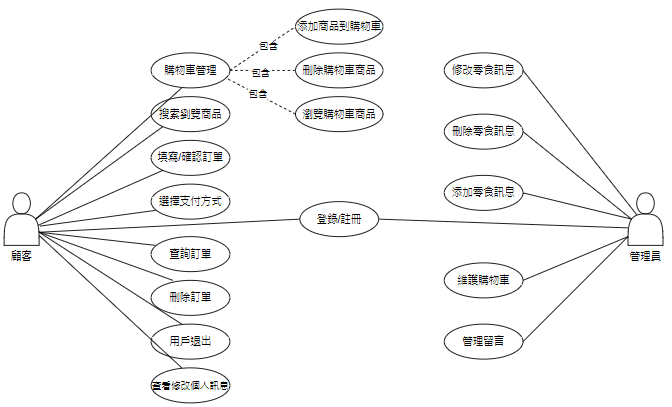

系统的用户总共有两类用户：管理员和顾客，并且不同用户有不同的权限。系统用例图如图3-1所示:

**3.1.2 系统用例说明** 
--------------
1.登录用例用户输入自己已注册完成的账号，密码，登陆成功后进入前台界面浏览商品选购商品如下表3-1所示：

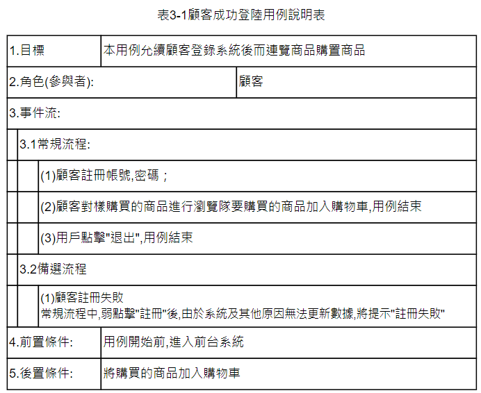

2.商品管理功能用例是对前台显示的商品信息进行维护等操作。详细描述如下表 3-2所示：

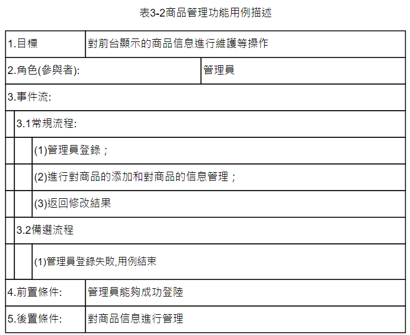

3.购物车用例对需要买的商品进行添加购物车操作，浏览商品信息，对商品进行购买。详细描述如下表 3-3所示：

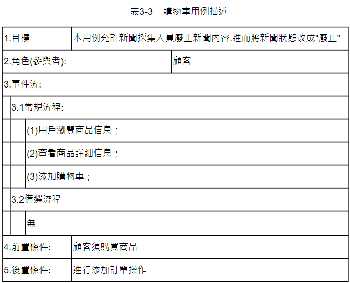

**3.2 需求分析**
==========
**3.2.1 业务需求分析**
----------------------
系统应满足如下业务需求：

随着计算机的日益发展和完善，电子商务越来越普及，设计的系统越来越完善，都 可能受到时间和空间上的制约。所以，在设计每一个项目开始，必须对系统实行可行性 分析，这样可以降低系统的执行力，降低损耗。为了保证零食销售系统的成功开发和正常运行，分别从技术、经济等多方面对本系统进行需求分析。

**3.2.2 用户需求分析**
------------------
系统的用户总共有两类用户：管理员、顾客。

1.管理员可以修改零食信息、删除零食信息、添加零食信息、维护零食信息、维护购物车、管理留言等操作都能够执行。

2.顾客可以对购物车进行管理、浏览搜索商品、填写订单、选择支付方式、查询订单、删除订单、用户退出、查看、修改个人信息。

**3.2.3 功能需求分析**
--------------------
在线零食销售系统要实现的总体功能是具有以下几个重要的功能需求：

1.可以让顾客在平台上浏览商品。

2.可以让顾客在网上进行支付。

3.可以让顾客申请退货、换货。

4.顾客可以对购物车进行管理。

4.管理员可以对商品信息进行增删改查。

5.管理员、顾客可以进行注册登录。

6.管理员对顾客留言进行管理

**3.2.4 非功能需求分析**
------------------------
（1）系统应在5秒内响应所有用户请求。

（2）系统应同时相应1000以上用户请求。

（3）系统应每时相应10000以上用户业务请求。

（4）系统应在每天24小时、每周7天都可以正常使用。

（5）登录和操作系统必须是合法的操作员才能够进行操作，并对其进行严格的管理和筛选过滤，进而保证系统操作证的合法性和系统的安全性。

（7）应用系统安全上要有一定的保障，记录信息应全部记录齐，不可遗漏信息，并保障系统不会因为人为的操作错误而死机或崩溃；

（8）系统应有较好的可维修性，以便在系统出现故障时能在24小时内恢复运行。

**3.2.5 约束条件分析**
------------------------
（1）系统必须使用Java语言，采用SSH框架编写。

（2）系统必须使用MySql数据库应用系统。

（3）系统开发过程和交付文档必须遵循GB/T 8567-2006标准。

（4）系统服务必须运行在Win7及以上64位操作系统。

（5）系统应兼容IE、火狐、360等主流浏览器。

**3.2.6 业务规则分析**
------------------
（1）如果操作员是管理员，则能管理本系统的相关信息。

（2）如果操作员是顾客，则仅能进行账号注册和登录，浏览商品和购置商品。

（3）如果顾客对商品有想买的意愿，则可以先对商品进行加入购物车。

（4）如果系统出现商品添加，删除，查询不成功等状况，则将信息反馈给管理员。

（5）如果系统在商品管理未维护好之前，则将限制顾客进行购买功能。

**3.2.7 外部接口需求分析**
-------------------
（1）系统应提供符合Web应用程序的人机交互界面。

（2）系统配置文件必须采用XML文件格式。

（3）各模块过程之间采用函数调用、参数传递、返回值的方式进行消息传递。

（4）接口传递的信息将是以数据结构封装了的数据，以参数传递或返回值的形式在模块之间传递。

 **第四章  系统设计**
 =========================
**4.1 实体类模型设计**
--------------------------------
在线零食销售系统，主要有两大实体，顾客和管理员。管理员和顾客是一对多的联系，
系统实例类及关系如图4-1所示:

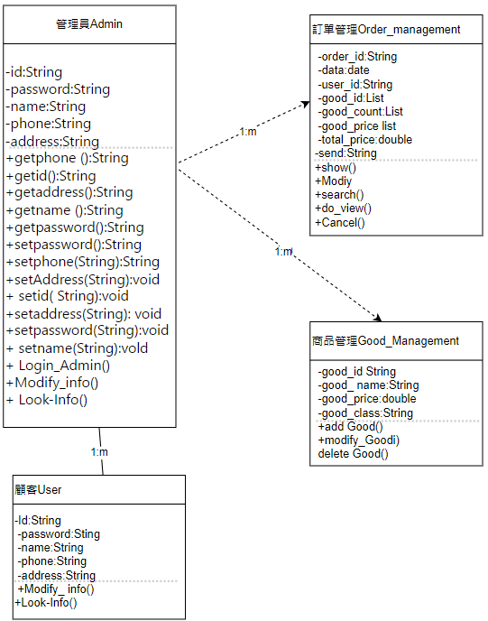

**4.2 动态模型设计**
------------

**1.购物车活动建模**

购物车操作主要步骤如下所示:

 1.顾客先登录到购物车界面。
 2.顾客选择要执行的操作。
 3.购买商品。
 4.结束进程。  如图4-2所示:

 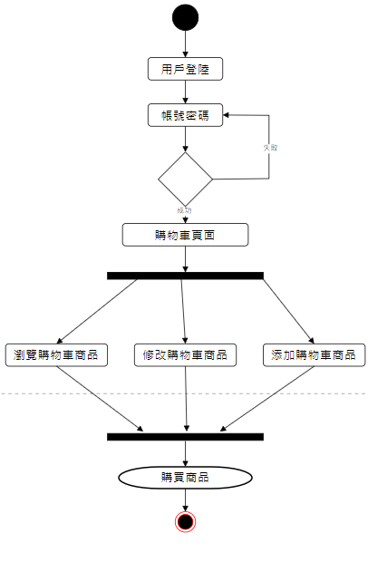

 **2.商品管理活动建模**
 商品管理操作主要步骤如下所示:

 1.管理员先登录到商品管理系统界面。

 2.管理员选择要执行的操作。

 3.管理商品信息。

 4.结束进程。  如图4-3所示:

 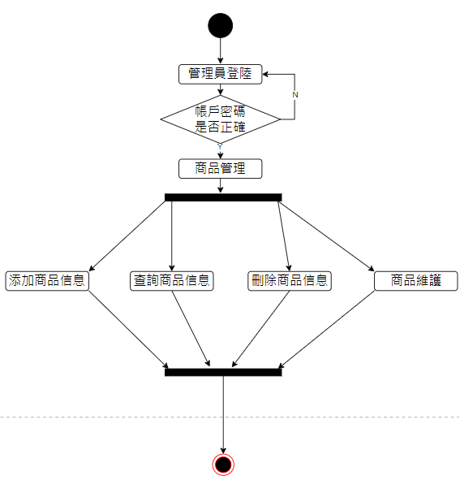

 2.购物车时序建模

购物车时序图是顾客选择商品后对商品进行浏览，进行购买后会返回下单结果。如图4-4所示：

 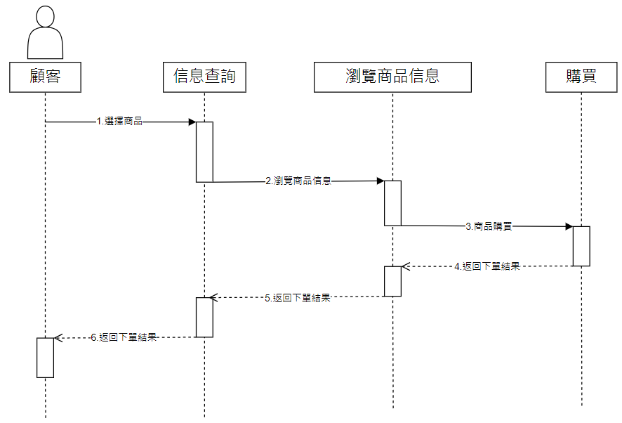

 3. 商品管理时序建模

商品管理时序图是管理员进入系统前台界面对商品进行添加，删除，查询，维护等操作。如图4-5 所示：

 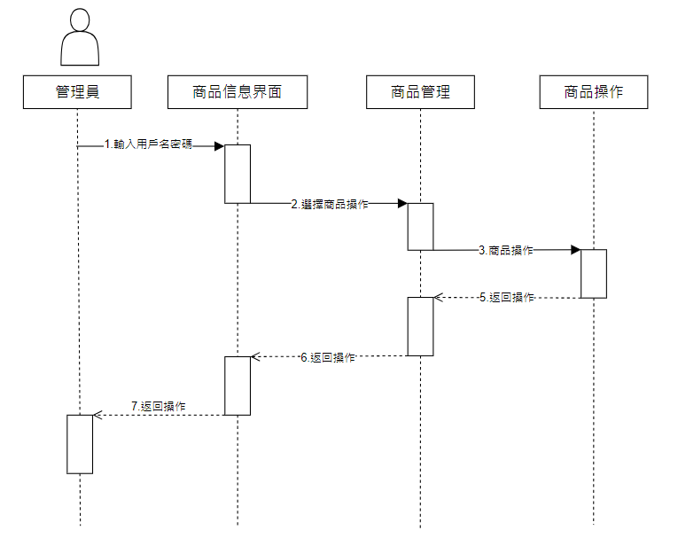

**4.3 数据模型设计**
----------------
根据系统用例模型和实体类模型，可以建立了以下数据库逻辑结构，仅列出新闻发布使用的各数据表的详细说明。

**第五章  系统实现**
==================
**5.1 开发环境**
-----------------
1．软件环境

（1）MySQL数据库系统；

（2）MyEclipse开发环境；

（3）Spring、Struts、Hibernate框架。

2．硬件环境

（1）CPU类型： Intel Haswell CPU

（2）CPU速度： 2.8GHz

（3）硬盘容量：500G

（4）内存容量：4G

**5.2 商品信息管理模块实现**
------------------------
商品信息管理页面列出了添加的商品信息，包括商品名称，商品价格，商品数量，商品类型。该系统前景页示于图5-1所示：

 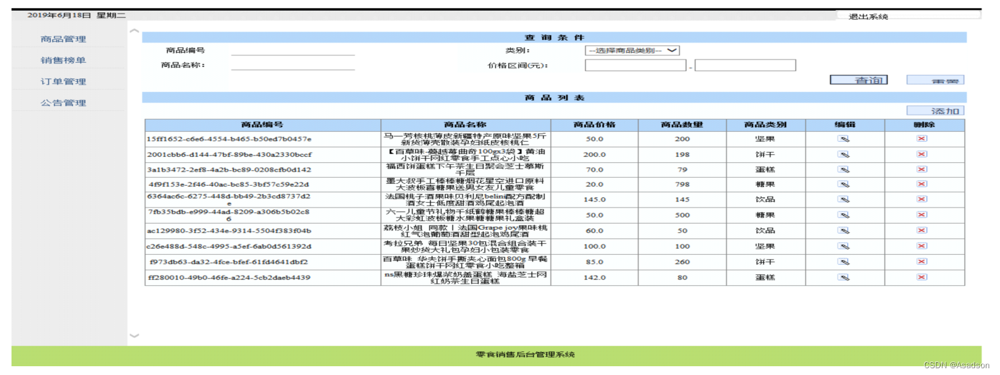

 **5.3 管理购物车模块实现**
 ---------------
 该单元实现购物车的信息管理功能。点击网站浏览购物车并进入购物车的管理界面，显示当前购买的零食信息，顾客可以删除购物车中的特定记录，或者可以创建请求并提交购物车的内容，效果图如图5-2所示。

 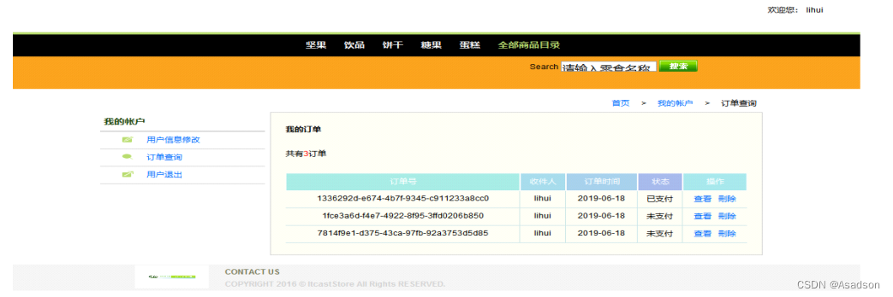

**第六章  系统测试**
=================
**6.1 测试工具**
-------------
（1）手工测试。

（2）LoadRunner[自动化测试工具](https://max.book118.com/html/2018/0501/164016314.shtm)。

**6.2 单元测试**
-----------------------
本次采用黑盒子等价类划分法对新闻发布模块进行测试。

1. 建立等价类表

 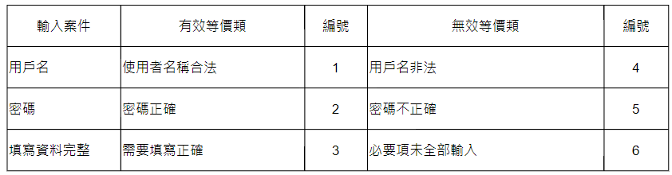

2. 设计测试用例
   
 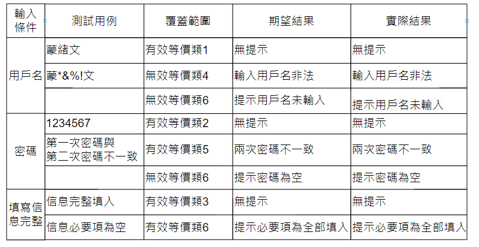
 
偏差：无

测试结果：能够验证用户名和密码的正确性，系统登录功能正常实现。

**6.3 压力测试**
------------------

压力测试中，使用LoadRun自动化测试工具完成整体系统的测试工作，主要测试项目如下：

1. 响应时间

响应时间是指用户从客户端发出请求到接收完服务器返回结果的整个过程所需花费的时间，包含网络传输时间以及服务器处理时间。从用户角度来看，响应时间应该从客户端计算机处理用户操作并发出请求到客户端程序收到服务器端返回结果并显示出来的时间。

结果：<1秒

2. 并发用户数

并发用户数是指在一定时间内，某一时刻同时与服务器进行会话操作的用户数，并发用户数的类型包括：系统用户数、同时在线用户数，业务并发用户数。

结果：>1000

3. 吞吐量

吞吐量是指单位时间内，系统处理用户的请求数或页面数量，可以直接反映出软件的承载能力。一般来说，利用每秒钟的请求数或页面数量衡量吞吐量；从业务的角度来看，也可以用每天的访问人数或每小时处理的业务数来衡量。

结果：3×24   50000次/h

**《点击下载》其他软件工程大作业链接：**

[软件工程大作业-员工宿舍管理系统-点击下载](https://download.csdn.net/download/qq_46628483/87205278?spm=1001.2014.3001.5503)

[软件工程大作业-网上订餐系统-点击下载](https://download.csdn.net/download/qq_46628483/87205068?spm=1001.2014.3001.5503)

[软件工程大作业-日记管理系统-点击下载](https://download.csdn.net/download/qq_46628483/87216381?spm=1001.2014.3001.5503)

[软件工程大作业-财务预约系统-点击下载](https://download.csdn.net/download/qq_46628483/87216374?spm=1001.2014.3001.5503)

